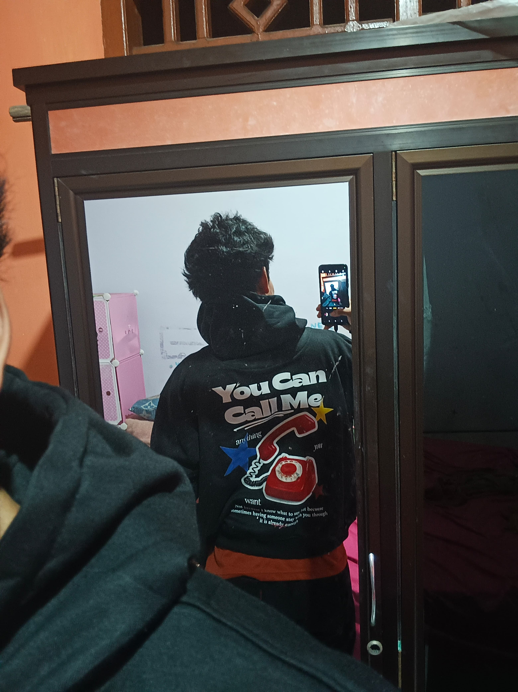

<!DOCTYPE html>
<html lang="en">
<head>
<meta charset="UTF-8">
<meta name="viewport" content="width=device-width, initial-scale=1.0">
<title>Happy Birthday ❤️</title>

</head>
<body>

    <h1>Happy Birthday My Love 🎉❤️</h1>

    

        
<b>English:</b>

        

            Happy birthday to the most special person in my life.  
            Thank you for always being there for me, for your love, your care, and your patience.  
            I hope this year brings you happiness, success, and everything you’ve been wishing for.  
            I love you more than words can explain 💖
        

    

    

        
<b>Indonesia:</b>

        

            Selamat ulang tahun untuk orang paling spesial di hidupku.  
            Terima kasih sudah selalu ada buat aku, atas cinta, perhatian, dan kesabaran kamu.  
            Semoga di tahun ini kamu mendapatkan kebahagiaan, kesuksesan, dan semua yang kamu impikan.  
            Aku sayang kamu lebih dari yang bisa aku ungkapkan 💖
        

    

    

        <h2>Our Memories 📸</h2>
        
        
        
    

    

        <h2>For You 🎶</h2>
        
About You - The 1975

        <audio controls autoplay loop>
            <source src="anything you want.mp3" type="audio/mpeg">
        </audio>
    

</body>
</html>
